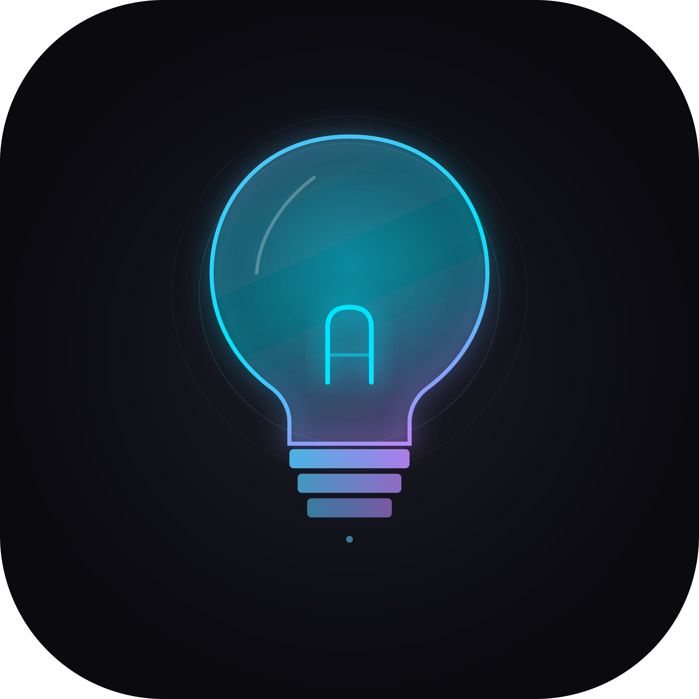
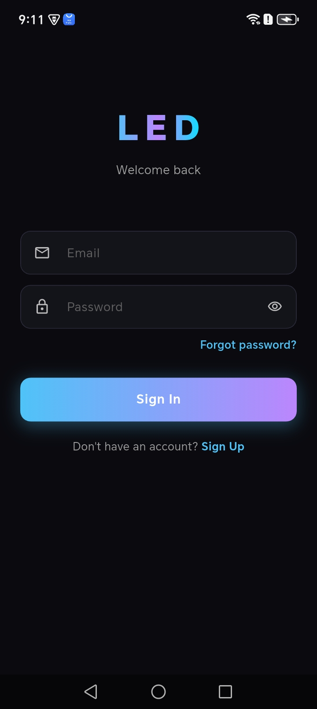
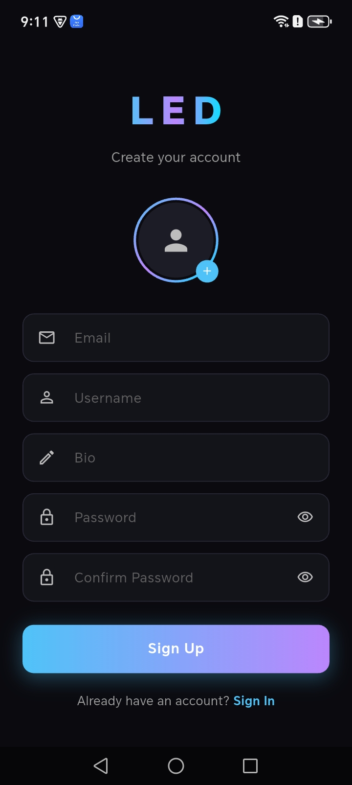
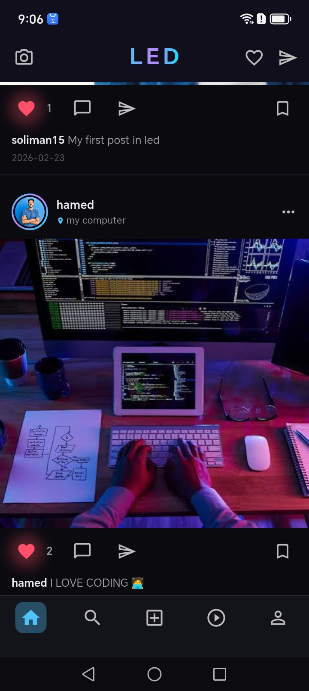
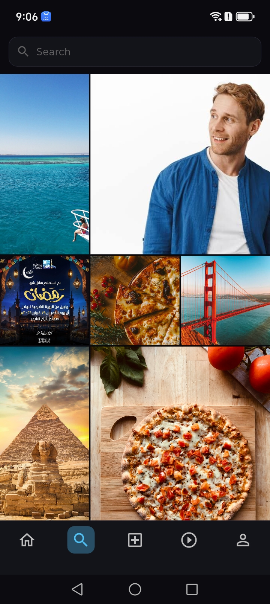
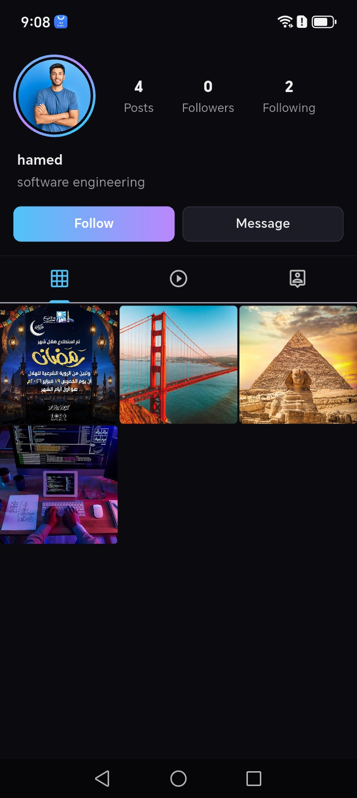
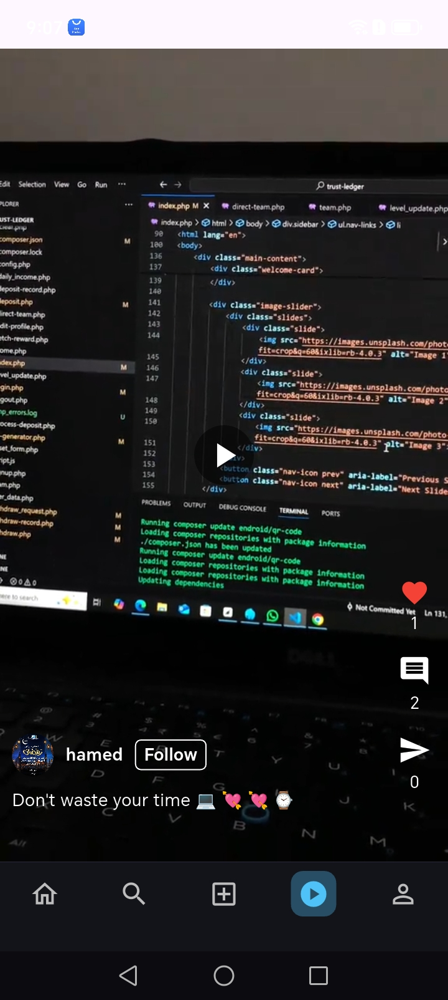
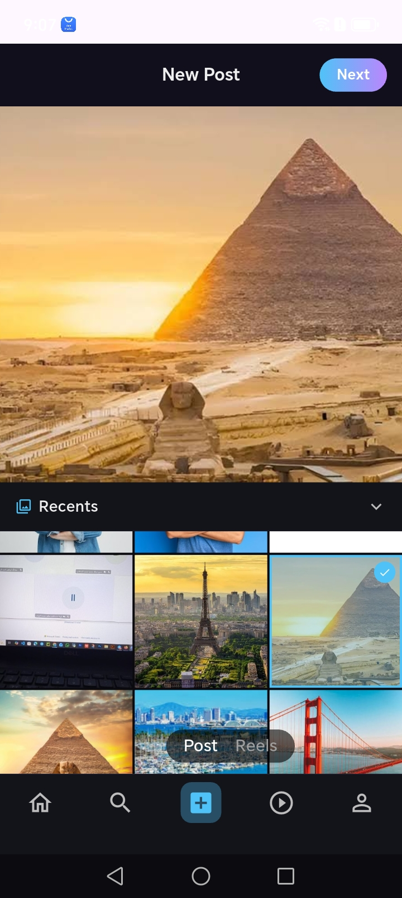
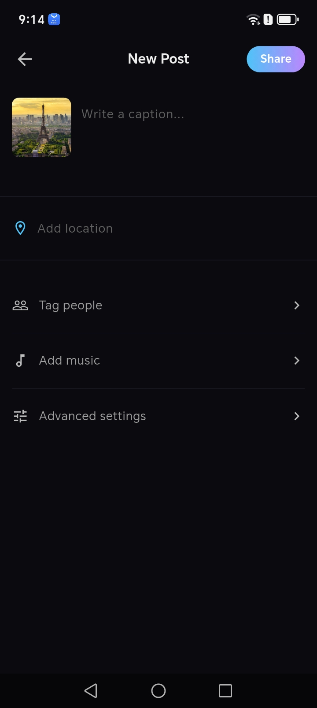
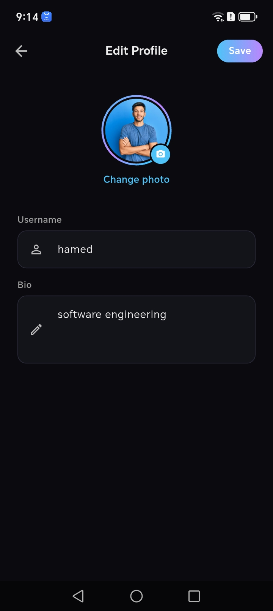

<div align="center">



# LED

### A modern social media app built with Flutter & Firebase


</div>

---

## 📱 About

**LED** is a full-featured social media application inspired by modern photo & video sharing platforms. Built entirely with Flutter and Firebase, it delivers a smooth, dark-themed experience with a signature glow aesthetic.

The name **LED** reflects the core identity of the app — light, clarity, and modern energy. Every screen is designed with a dark background and electric blue/purple glow palette to match that vision.

---

## ✨ Features

- 🔐 **Authentication** — Sign up & sign in with email/password via Firebase Auth
- 🏠 **Home Feed** — Real-time post feed ordered by latest
- 📸 **Post Sharing** — Upload photos with captions and location tags
- 🎬 **Reels** — Upload and watch short videos
- ❤️ **Interactions** — Like posts with double-tap animation, comment in real-time
- 🔍 **Explore** — Discover posts and search for users
- 👤 **Profile** — View and edit your profile, follow/unfollow users
- ✏️ **Edit Profile** — Update username, bio, and profile photo

---

## 📸 Screenshots

<div align="center">

| Login | Sign Up | Home |
|-------|---------|------|
|  |  |  |

| Explore | Profile | Reels |
|---------|---------|-------|
|  |  |  |

| Upload Post | Add Post Details | Edit Profile |
|-------------|-----------------|--------------|
|  |  |  |

</div>

---

## 🛠️ Tech Stack

| Layer | Technology |
|-------|-----------|
| Framework | Flutter |
| Language | Dart |
| Backend | Firebase |
| Database | Cloud Firestore |
| Storage | Firebase Storage |
| Auth | Firebase Authentication |
| State | setState / StreamBuilder |
| UI Scaling | flutter_screenutil |
| Image Caching | cached_network_image |
| Media Picker | photo_manager |
| Video Player | video_player |

---

## 🗂️ Project Structure

```
lib/
├── auth/
│   ├── auth_screen.dart
│   └── mainpage.dart
├── core/
│   └── app_colors.dart
├── data/
│   ├── firebase_service/
│   │   ├── firebase_auth.dart
│   │   ├── firestore.dart
│   │   └── storage.dart
│   └── models/
│       └── usermodel.dart
├── screens/
│   ├── home.dart
│   ├── login_screen.dart
│   ├── signup_screen.dart
│   ├── profilescreen.dart
│   ├── edit_profile_screen.dart
│   ├── exploerscreen.dart
│   ├── reelsscreen.dart
│   ├── add_post_or_reels_screen.dart
│   ├── addpostscreen.dart
│   ├── addreelsscreen.dart
│   ├── add_text_for_post.dart
│   ├── add_text_for_reel.dart
│   └── post_screen.dart
├── widgets/
│   ├── navigation.dart
│   ├── post_widget.dart
│   ├── reel_widget.dart
│   ├── comment_widget.dart
│   └── like_animation.dart
└── util/
    ├── cache_image.dart
    ├── dialog.dart
    ├── exceptions.dart
    └── imagepicker.dart
```

---

## 🚀 Getting Started

### Prerequisites

- Flutter SDK `>=3.0.0`
- Dart SDK `>=3.0.0`
- A Firebase project with Firestore, Storage, and Authentication enabled

### Installation

**1. Clone the repository**
```bash
git clone https://github.com/your-username/led.git
cd led
```

**2. Install dependencies**
```bash
flutter pub get
```

**3. Configure Firebase**

- Create a Firebase project at [console.firebase.google.com](https://console.firebase.google.com)
- Enable **Email/Password** authentication
- Enable **Cloud Firestore**
- Enable **Firebase Storage**
- Download `google-services.json` and place it in `android/app/`
- Update `lib/firebase_options.dart` with your project credentials

**4. Run the app**
```bash
flutter run
```

---

## 🔒 Firebase Security Rules

**Firestore:**
```js
rules_version = '2';
service cloud.firestore {
  match /databases/{database}/documents {
    match /{document=**} {
      allow read, write: if request.auth != null;
    }
  }
}
```

**Storage:**
```js
rules_version = '2';
service firebase.storage {
  match /b/{bucket}/o {
    match /{allPaths=**} {
      allow read, write: if request.auth != null;
    }
  }
}
```

---

## 🎨 Design System

The entire app uses a unified dark theme defined in `lib/core/app_colors.dart`.

| Token | Color | Usage |
|-------|-------|-------|
| `background` | `#0A0A0F` | Main background |
| `surfaceCard` | `#13131A` | Cards & containers |
| `primary` | `#4FC3F7` | Electric blue accent |
| `accent` | `#BB86FC` | Purple accent |
| `like` | `#FF4F6A` | Like button |
| `textPrimary` | `#EEEEEE` | Main text |
| `textSecondary` | `#9E9E9E` | Subtitle text |

---

## 👨‍💻 Author

**Hamed Refaat**

[](https://github.com/hamedrefaat1)

---

<div align="center">
 <sub> Made with ❤️ using Flutter </sub>
<sub>⭐ If you found this project useful, consider giving it a star!</sub>
</div>
